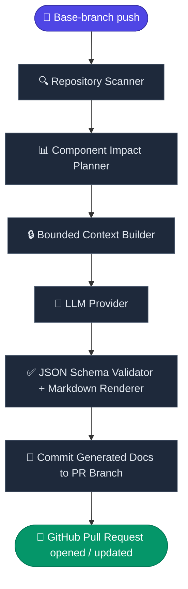
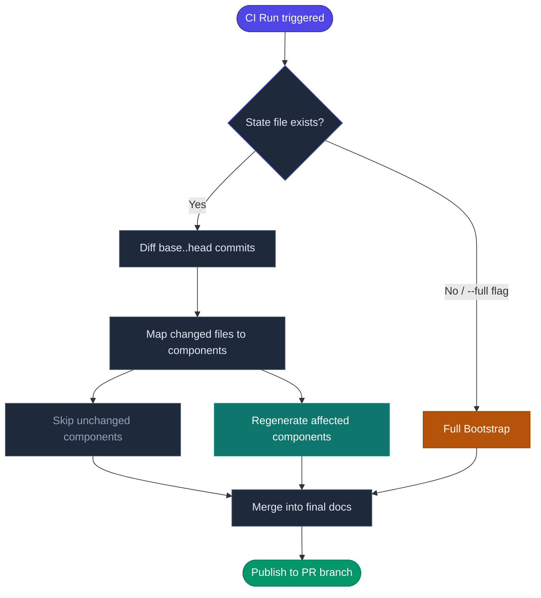
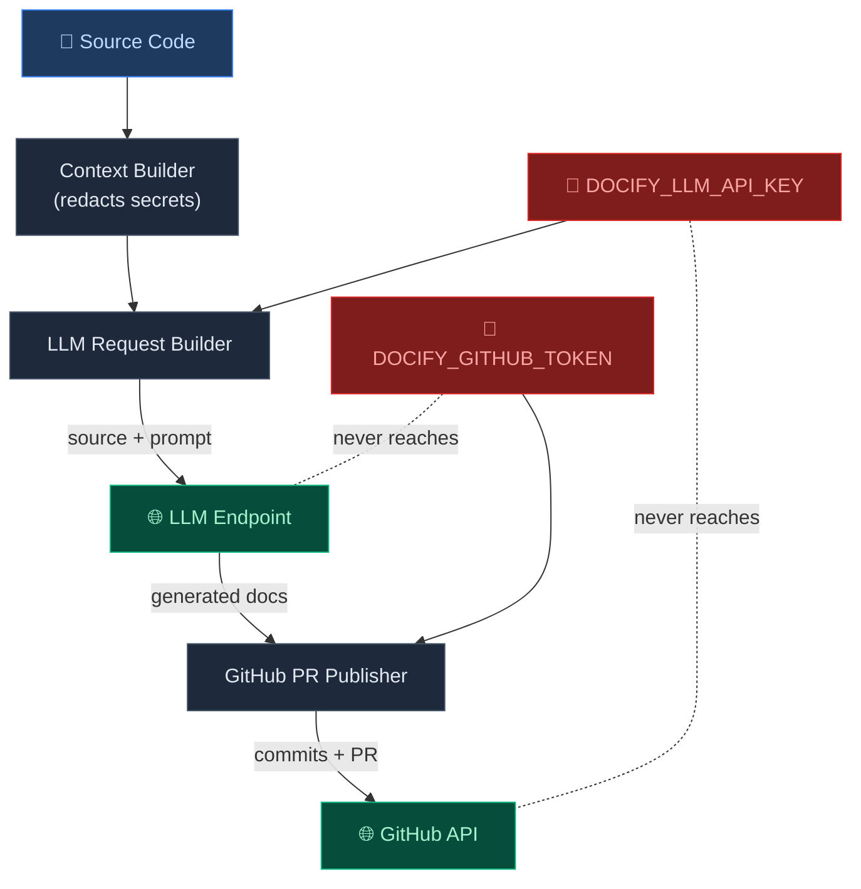

# docify-repo

> **Automated, living documentation for your repository — generated in CI, updated on every merge.**

[](https://github.com/amit-upadhyay-IT/docify-repo/actions/workflows/ci.yml)
[](./LICENSE)
[](https://golang.org/)
[](#)

`docify-repo` is a small, containerized CLI tool that generates and incrementally maintains repository documentation inside CI. It treats Git-tracked source files as its input model and uses an LLM to synthesize a living knowledge base — covering architecture, components, interfaces, data models, workflows, dependencies, and visual Mermaid diagrams — then opens a GitHub Pull Request with the result.

It is a **deterministic pipeline, not an autonomous agent**. The LLM writes prose; every control decision — which files to read, which components to regenerate, which paths to write — is made locally by Go code.

---

## Table of Contents

- [Why docify-repo?](#why-docify-repo)
- [Who Is It For?](#who-is-it-for)
- [How It Works](#how-it-works)
- [What It Generates](#what-it-generates)
- [Getting Started](#getting-started)
  - [Prerequisites](#prerequisites)
  - [Quick Start (Docker)](#quick-start-docker)
  - [Build from Source](#build-from-source)
- [Configuration](#configuration)
- [CI/CD Integration](#cicd-integration)
- [CLI Reference](#cli-reference)
- [LLM Providers](#llm-providers)
- [Security](#security)
- [Contributing](#contributing)
- [License](#license)

---

## Why docify-repo?

Documentation rots. Code evolves rapidly, but docs are written once and quickly fall out of sync. Keeping them current is a manual, time-consuming task that rarely happens consistently.

`docify-repo` solves this by running documentation generation as a first-class CI step — the same way you run tests or linters:

| Without `docify-repo` | With `docify-repo` |
|---|---|
| Docs are written manually and go stale | Docs are regenerated automatically on every merge |
| Only supports one language or framework | Works with **any** language — no toolchain needed |
| A full LLM rewrite every time is expensive | Only **affected components** are regenerated |
| AI agents are unpredictable and hard to audit | A deterministic pipeline: the LLM writes prose, Go code makes all decisions |
| Source code may leak through tools | LLM gets **no tools, no filesystem access, no shell** |

---

## Who Is It For?

**`docify-repo` is useful for:**

- **Maintainers** who want onboarding docs to stay accurate without maintaining them by hand.
- **Onboarding developers** who need to understand a large or unfamiliar codebase quickly.
- **API consumers** who rely on interface and data-model documentation being current.
- **AI coding assistants** (Copilot, Cursor, Gemini Code Assist, etc.) that use repository context files to give better suggestions — `docify-repo` generates an `index.md` designed to serve as that context.
- **Platform/DevOps teams** who want to enforce documentation hygiene as a CI gate (`docify-repo check`).
- **Open-source projects** that want professional documentation without the maintenance overhead.

---

## How It Works



The pipeline is incremental: only source files that changed between the base and head commits are considered. Unchanged components are not regenerated, keeping LLM costs proportional to the actual diff.

### Incremental vs. Full Run



---

## What It Generates

All output is written to `docs/generated/` (configurable). A full bootstrap produces:

| File | Contents |
|---|---|
| `index.md` | Primary navigation guide and AI-assistant context file |
| `codebase_info.md` | Languages, manifests, entry points, and technology summary |
| `architecture.md` | Architectural patterns, component boundaries, Mermaid architecture views |
| `components.md` | Component catalog with links to detail pages |
| `components/<path>/index.md` | Per-component purpose, behavior, and local diagrams |
| `interfaces.md` | Public APIs, internal interfaces, events, and integration points |
| `data_models.md` | Domain entities, schemas, and relationships |
| `workflows.md` | Runtime and development flows with Mermaid sequence/flow diagrams |
| `dependencies.md` | External services and libraries with repo-specific usage notes |
| `review_notes.md` | Gaps, inconsistencies, and areas requiring manual review |

Each section within a topic document is owned by a specific component. When a component changes, only its sections are updated — unrelated sections are left byte-for-byte untouched.

---

## Getting Started

### Prerequisites

- **Git** — available on the runner or local machine.
- **An OpenAI-compatible LLM endpoint** — qualify the exact provider/model against the production schemas before rollout.
- **Docker** (recommended for CI) or **Go 1.26+** (for local builds).
- A **GitHub token** with `contents: write` and `pull-requests: write` (for the `github-pr` publisher).

### Quick Start (Docker)

> **Note:** The image is not yet published to a public registry. Use the [build from source](#build-from-source) instructions below, or watch for the first release.

Once published, the one-liner will be:

```bash
docker run --rm \
  -v "$(pwd):/workspace" \
  -w /workspace \
  -e HOME=/tmp \
  -e DOCIFY_BASE_SHA="<before-sha>" \
  -e DOCIFY_HEAD_SHA="<head-sha>" \
  -e DOCIFY_LLM_BASE_URL="https://generativelanguage.googleapis.com/v1beta/openai" \
  -e DOCIFY_LLM_API_KEY="<your-api-key>" \
  -e DOCIFY_LLM_MODEL="gemini-2.0-flash" \
  ghcr.io/amit-upadhyay-IT/docify-repo:latest sync
```

### Build from Source

```bash
# Clone the repository
git clone https://github.com/amit-upadhyay-IT/docify-repo.git
cd docify-repo

# Build the binary
go build -o bin/docify-repo ./cmd/docify-repo

# Verify it works
./bin/docify-repo --help
```

**Run a dry run (no LLM calls):**

```bash
export DOCIFY_BASE_SHA="$(git rev-parse HEAD~1)"
export DOCIFY_HEAD_SHA="$(git rev-parse HEAD)"

./bin/docify-repo plan
```

**Generate docs locally:**

```bash
export DOCIFY_LLM_BASE_URL="https://generativelanguage.googleapis.com/v1beta/openai"
export DOCIFY_LLM_API_KEY="<your-api-key>"
export DOCIFY_LLM_MODEL="gemini-2.0-flash"

./bin/docify-repo sync
```

---

## Configuration

Add a `.docify.yml` file to the root of your repository:

```yaml
version: 1
docs_dir: docs/generated

source:
  include:
    - "**/*"
  exclude:
    - "vendor/**"
    - "node_modules/**"
    - "dist/**"
    - "**/*.min.js"
    - "**/*.lock"
  tests:
    include_as_context: true
    trigger_on_change: false
  generated:
    include: false

components:
  strategy: inferred        # auto-detect from go.mod, package.json, pyproject.toml, etc.
  max_context_bytes: 120000
  max_request_bytes: 500000

documentation:
  profile: codebase-summary
  audience: mixed           # mixed | maintainers | consumers
  mermaid: true

llm:
  provider: openai-compatible
  model: gemini-2.0-flash   # overridable via DOCIFY_LLM_MODEL
  temperature: 0
  max_output_tokens: 8192
  max_response_bytes: 65536

publishing:
  provider: worktree        # worktree | github-pr
```

**Credentials and CI-specific values are always environment variables, never committed config:**

| Variable | Required | Description |
|---|---|---|
| `DOCIFY_LLM_BASE_URL` | Yes | Base URL of your OpenAI-compatible LLM endpoint |
| `DOCIFY_LLM_API_KEY` | Yes | API key for the LLM endpoint |
| `DOCIFY_LLM_MODEL` | No | Overrides the model from `.docify.yml` |
| `DOCIFY_GENERATION_STRATEGY` | No | Temporarily overrides `dossier`, `fragments`, or `auto` for qualification |
| `DOCIFY_BASE_SHA` | Yes | The `before` commit SHA of the CI event |
| `DOCIFY_HEAD_SHA` | Yes | The `after` (current) commit SHA |
| `DOCIFY_GITHUB_TOKEN` | `github-pr` only | Token with `contents: write`, `pull-requests: write` |
| `DOCIFY_GITHUB_REPOSITORY` | `github-pr` only | e.g., `owner/repo` |
| `DOCIFY_BASE_BRANCH` | `github-pr` only | e.g., `main` |

See [`docs/configuration.md`](docs/configuration.md) for the full reference, including source role overrides, and [`docs/fragment-qualification.md`](docs/fragment-qualification.md) for fragment provider and quality rollout gates.

---

## CI/CD Integration

Copy the workflow below into `.github/workflows/docify-repo.yml`. It triggers on every push to `main`, skips runs caused by the generated-docs PR itself, and serializes concurrent runs to prevent race conditions on the documentation branch.

```yaml
name: docify-repo

on:
  push:
    branches: [main]
    paths-ignore:
      - "docs/generated/**"
      - ".docify/state.json"

permissions:
  contents: write
  pull-requests: write

concurrency:
  group: docify-${{ github.ref }}
  cancel-in-progress: false

jobs:
  docify-repo:
    runs-on: ubuntu-latest
    steps:
      - uses: actions/checkout@v4
        with:
          fetch-depth: 0
          persist-credentials: false

      - name: Generate documentation pull request
        run: |
          docker run --rm \
            --user "$(id -u):$(id -g)" \
            --cap-drop ALL \
            --security-opt no-new-privileges \
            -v "$GITHUB_WORKSPACE:/workspace" \
            -w /workspace \
            -e HOME=/tmp \
            -e DOCIFY_BASE_SHA="${{ github.event.before }}" \
            -e DOCIFY_HEAD_SHA="${{ github.sha }}" \
            -e DOCIFY_LLM_BASE_URL \
            -e DOCIFY_LLM_API_KEY \
            -e DOCIFY_LLM_MODEL \
            -e DOCIFY_GITHUB_TOKEN \
            -e DOCIFY_GITHUB_REPOSITORY="${{ github.repository }}" \
            -e DOCIFY_BASE_BRANCH="${{ github.event.repository.default_branch }}" \
            ghcr.io/amit-upadhyay-it/docify-repo:0.1.0 sync --publisher github-pr
        env:
          DOCIFY_LLM_BASE_URL: ${{ vars.DOCIFY_LLM_BASE_URL }}
          DOCIFY_LLM_API_KEY: ${{ secrets.DOCIFY_LLM_API_KEY }}
          DOCIFY_LLM_MODEL: ${{ vars.DOCIFY_LLM_MODEL }}
          DOCIFY_GITHUB_TOKEN: ${{ github.token }}
```

> **Before production use:** pin both the `actions/checkout` action and the `docify-repo` image by immutable `@sha256` digest.
> Your repository must allow GitHub Actions to create pull requests (**Settings → Actions → General → Allow GitHub Actions to create and approve pull requests**).

---

## CLI Reference

```
docify-repo <command> [flags]
```

| Command | Description |
|---|---|
| `sync` | Update generated docs in the mounted workspace. |
| `sync --publisher github-pr` | Prepare a documentation branch, push it, and open or update a PR. |
| `check` | Generate into a temp location and exit non-zero if committed docs are stale. Use this as a CI gate. |
| `plan` | Report affected components, byte/token estimates, and expected LLM calls **without** calling the LLM. |

**Common flags:**

```
--full              Force a full bootstrap regardless of committed state.
--config string     Path to .docify.yml (default: auto-detected).
--log-json          Emit structured JSON logs.
--summary string    Write a JSON run report to this path.
```

---

## LLM Providers

`docify-repo` works with any OpenAI-compatible HTTP endpoint. No model name is compiled into the image.

| Provider | `DOCIFY_LLM_BASE_URL` | Notes |
|---|---|---|
| **Google Gemini** | `https://generativelanguage.googleapis.com/v1beta/openai` | Tested with `gemini-2.0-flash` and `gemini-2.0-flash-lite`. Set `DOCIFY_LLM_API_KEY` to your Gemini API key. |
| **Vertex AI** | Your Vertex AI OpenAI-compatible gateway URL | Use a short-lived bearer token. A native Vertex adapter (Application Default Credentials / Workload Identity) is planned. |
| **Self-hosted / other** | Any OpenAI-compatible endpoint | LiteLLM, OpenRouter, vLLM, Ollama with OpenAI compatibility, etc. |

`temperature: 0` is set by default to maximize output stability. `DOCIFY_LLM_MODEL` always overrides the model in `.docify.yml`, so you can switch models without rebuilding the image.

---

## Security

`docify-repo` is designed with a strong security posture for a tool that reads source code and calls an external API.

**Key guarantees:**

- **Source code is sent only to your configured LLM endpoint.** No other network destination is contacted. Choose an endpoint whose data-handling terms are acceptable for your repository's contents.
- **The LLM has no tools.** It cannot run commands, read files, or access environment variables. Prompt injection in source comments cannot cause code execution.
- **Repository code is never executed.** Git subprocesses run with hooks, commit signing, external diff commands, and interactive prompts disabled.
- **Credentials are isolated.** The GitHub token never reaches the LLM request builder. The LLM API key never reaches the GitHub publisher.
- **Writes are bounded.** The tool only writes to `docs/generated/**` and `.docify/state.json`. It refuses to overwrite files it does not own.
- **Non-root container.** The image declares a fixed non-root user. The reference workflow additionally drops all Linux capabilities.

### Credential Isolation Flow



> The dashed lines show what **cannot** happen — each credential is scoped to exactly one external destination.

See [`docs/security.md`](docs/security.md) for the full threat model, credential flow, and operator checklist.

---

## Contributing

Contributions are welcome! This project is in **beta** — bug reports, feedback on the generated documentation quality, and ideas for new features are all valuable.

**To contribute:**

1. **Open an issue first** for anything beyond a small bug fix, so we can discuss the approach before you invest time coding.
2. **Fork and branch** — work on a feature branch off `main`.
3. **Run the tests** before submitting:
   ```bash
   go test ./...
   ```
4. **Open a pull request** with a clear description of what changed and why.

Please be respectful and constructive in all interactions.

---

## License

[MIT](./LICENSE) © 2026 Amit Upadhyay
