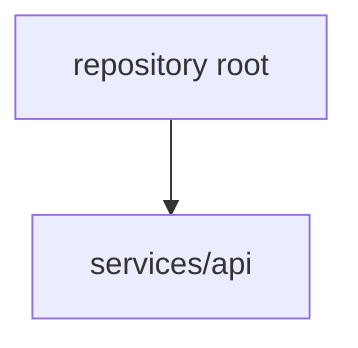

# Codebase Info

Deterministic metadata collected by the scanner. This document contains no model output.

## Summary

| Metric | Value |
| --- | --- |
| Tracked files | 4 |
| Included as context | 4 |
| Triggering regeneration | 3 |
| Excluded | 0 |
| Components | 2 |

## Languages

| Language | Files |
| --- | --- |
| Go | 2 |

## Dependency Manifests

- [`go.mod`](../../go.mod)

## Component Hierarchy

