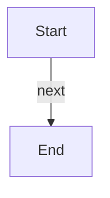

# Component @root

Component `@root`.

## Purpose

Deterministic test dossier for the component.

## Source Paths

- [`go.mod`](../../../../go.mod)

## Architecture

### Primary responsibility

Owns behavior in the component.

Source: [`go.mod`](../../../../go.mod)

## Interfaces

_No interfaces documented for this component._

## Data Models

_No data models documented for this component._

## Workflows

_No workflows documented for this component._

**Flow**

## Dependencies

_No dependencies documented for this component._

## Review Gaps

_No review gaps reported._
