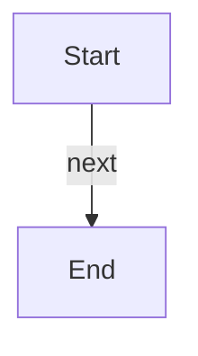

# Workflows

Workflows owned by each component. Sections are managed by docify-repo.

<!-- docify:begin topic="workflows" key="@root" -->
## `@root`

_No workflows documented for this component._

**Flow**

<!-- docify:end topic="workflows" key="@root" -->

<!-- docify:begin topic="workflows" key="services/api" -->
## `services/api`

_No workflows documented for this component._

**Flow**

<!-- docify:end topic="workflows" key="services/api" -->
